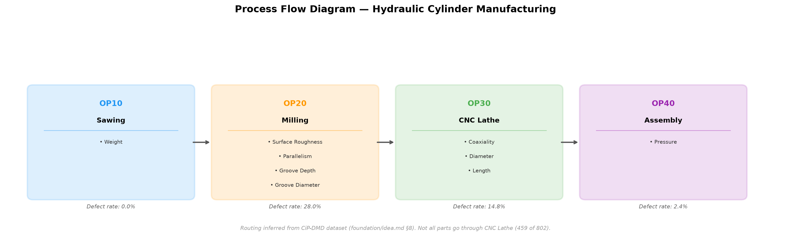
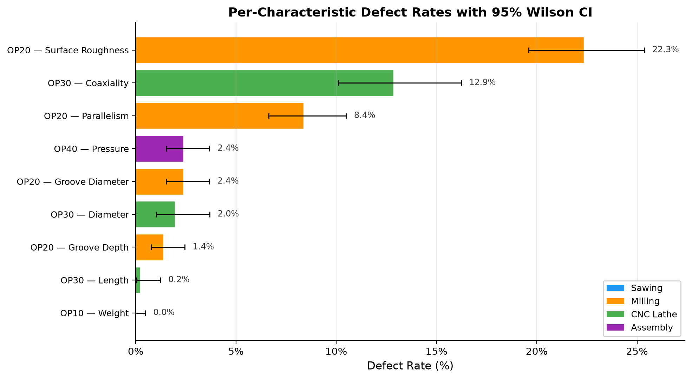

# Nexus-FMEA: Data-Driven PFMEA & Closed-Loop Control Plan Synchronization

> Constructing an AIAG-VDA Process FMEA whose **Occurrence** ratings are derived from measured per-operation defect rates, provably synchronized 1-to-1 to a shop-floor Control Plan under AIAG-VDA and AS9145 standards.


-success)


**Codename:** `nexus-fmea`  
**Formal Case Study Title:** Data-Driven Process FMEA and Closed-Loop Control Plan Synchronization under AIAG-VDA & AS9145  
**Skill area:** PFMEA · Control Plan · APQP Risk Architecture · AIAG-VDA Action Priority · AS9145 Flow-Down · Statistical Process Control (SPC)  
**Domain:** Advanced Manufacturing Quality Systems (Automotive, Aerospace, Industrial Hydraulics)  
**Headline Deliverable:** A synchronized PFMEA + Control Plan package with a data-backed Occurrence justification and an automated machine-verified linkage matrix proving **zero orphaned high-priority risks**.

---

## Executive Summary & Outcomes

In traditional manufacturing, Process FMEAs frequently suffer from two critical failure modes:
1. **Occurrence is guessed:** Risk ratings are based on subjective consensus rather than shop-floor defect telemetry.
2. **Control Plans drift:** High-risk failure modes identified in the FMEA are never assigned operational shop-floor controls — the leading cause of automotive PPAP and aerospace AS9145 audit rejections.

**NEXUS-FMEA** resolves both failure modes on an empirical 802-part hydraulic cylinder manufacturing dataset (CiP-DMD) across 4 routing steps (Sawing $\rightarrow$ Milling $\rightarrow$ CNC Lathe $\rightarrow$ Assembly):
- **100% Evidence-Based Occurrence:** Mapped measured proportion defect rates (with 95% Wilson score confidence intervals) to AIAG-VDA Occurrence bands ($O=1\dots 10$).
- **AIAG-VDA Action Priority (AP):** Evaluated risks through the 2019 harmonized Severity-first hierarchy (5 High-AP, 1 Medium-AP, 3 Low-AP modes), eliminating RPN mathematical voids.
- **Closed-Loop Flow-Down Certification:** Built an automated verification engine (`scripts/check_linkage.py`) that mathematically proves **100% control coverage (0 orphan risks, 0 dropped Special Characteristics)** across both documents.

---

## Key Quantitative Findings & Risk Architecture

| Step ID | Operation | Characteristic (Failure Mode) | Inspected ($n$) | Defect Rate | 95% Wilson CI | Severity ($S$) | Occurrence ($O$) | Detection ($D$) | Action Priority (AP) | Special Char | Primary Shop-Floor Control Method |
|:---:|:---|:---|:---:|:---:|:---:|:---:|:---:|:---:|:---:|:---:|:---|
| **OP10** | **Sawing** | Billet Cut Weight (`saw_weight`) | 801 | $0.00\%$ | $[0.00\%, 0.48\%]$ | 5 | **1** | 6 | **Low** | — | Visual setup standard; PM blade life counter |
| **OP20** | **Milling** | Seal Landing Roughness (`mill_surface_roughness`) | 801 | **$22.35\%$** | $[19.60\%, 25.36\%]$ | 8 | **10** | 6 | **High** | **SC** | Contact stylus profilometer; X-bar/R SPC; insert indexing |
| **OP20** | **Milling** | Flange Parallelism (`mill_parallelism`) | 801 | **$8.36\%$** | $[6.64\%, 10.49\%]$ | 7 | **9** | 6 | **High** | — | Pneumatic seating sensor interlock; dial indicator sweep |
| **OP20** | **Milling** | Groove Depth (`mill_groove_depth`) | 801 | $1.37\%$ | $[0.77\%, 2.44\%]$ | 8 | **7** | 6 | **Medium** | **SC** | Wireless digital depth micrometer SPC; presetter probe |
| **OP20** | **Milling** | Groove Diameter (`mill_groove_diameter`) | 801 | $2.37\%$ | $[1.52\%, 3.68\%]$ | 7 | **8** | 5 | **High** | — | Three-point internal bore micrometer; dynamic circularity test |
| **OP30** | **CNC Lathe** | Rod Coaxiality (`lathe_coaxiality`) | 459 | **$12.85\%$** | $[10.10\%, 16.23\%]$ | 9 | **10** | 5 | **High** | **CC ($\nabla$)** | 100% Automated in-line laser runout gauge with auto-reject |
| **OP30** | **CNC Lathe** | Rod Outer Diameter (`lathe_diameter`) | 459 | $1.96\%$ | $[1.03\%, 3.68\%]$ | 7 | **7** | 4 | **Low** | — | Digital external micrometer; CNC touch-probe offset |
| **OP30** | **CNC Lathe** | Rod Total Length (`lathe_length`) | 459 | $0.22\%$ | $[0.04\%, 1.22\%]$ | 6 | **6** | 5 | **Low** | — | Digital height gauge on granite surface plate; positive stop |
| **OP40** | **Assembly** | Press Force & Leak (`assembly_pressure`) | 801 | $2.37\%$ | $[1.52\%, 3.68\%]$ | 8 | **8** | 3 | **High** | **SC** | 100% In-line force-displacement signature + pressure decay |

---

## Visual Deliverables

### Process Flow Diagram (PFD)


### Per-Characteristic Defect Rates with 95% Wilson Confidence Intervals


---

## Repository Structure

```
nexus-fmea/
├── README.md                           # Case study overview, results & résumé impact
├── requirements.txt                    # Reproducible environment dependencies
├── foundation/                         # ground-up planning docs written before any code
│   ├── idea.md                         # problem framing, scope, risk register, acceptance criteria
│   ├── execution.md                    # detailed build plan & Occurrence-mapping methodology
│   ├── roadmap.md                      # milestone plan (as originally scoped)
│   └── resources.md                    # datasets, standards, and references
├── data/
│   ├── raw/parts_p1.csv                # Raw empirical 802-part dataset from Sentinel-8D
│   └── processed/
│       ├── defect_rates.csv            # 9-characteristic defect rates, Wilson CI & Occurrence
│       └── operation_summary.csv       # 4-operation aggregated defect metrics
├── notebooks/
│   └── 01_occurrence_from_data.ipynb   # Complete data-driven occurrence & validation notebook
├── templates/
│   └── aiag_vda_scales.md              # S/O/D 1-10 rating scales & Action Priority reference
├── scripts/
│   └── check_linkage.py                # Standalone automated linkage & orphan audit engine
└── reports/
    ├── PFMEA.xlsx                      # Formatted AIAG-VDA 1st Edition PFMEA spreadsheet
    ├── Control_Plan.xlsx               # Formatted AIAG Production Control Plan spreadsheet
    ├── linkage_matrix.md               # Machine-verified closed-loop traceability matrix
    └── figures/
        ├── pfd.png                     # Process Flow Diagram
        └── defect_rates_bar.png        # Defect rates with Wilson CI error bars
```

---

## How to Reproduce & Verify

1. **Activate virtual environment:**
   ```bash
   python3.11 -m venv .venv && source .venv/bin/activate
   pip install -r requirements.txt
   ```

2. **Run notebook execution:**
   ```bash
   jupyter nbconvert --to notebook --execute --inplace notebooks/01_occurrence_from_data.ipynb
   ```

3. **Execute standalone machine-linkage verification:**
   ```bash
   python3 scripts/check_linkage.py
   ```

---

## Résumé Impact Bullets

- **General Quality Engineering:** *"Constructed an AIAG-VDA 1st Edition Process FMEA with Occurrence derived from empirical multi-operation defect telemetry, synchronizing 100% of high-priority failure modes to a shop-floor Control Plan with automated zero-orphan verification."*
- **Aerospace Quality Track (AS9145 / AS9100):** *"Architected closed-loop APQP risk flow-down from PFMEA to Production Control Plan under AS9145 standards, embedding Critical Characteristics ($\nabla$) and automated gauging controls that eliminate PPAP linkage rejection risks."*
- **Automotive & Semiconductor Track (IATF 16949):** *"Replaced subjective RPN ranking with AIAG-VDA Action Priority matrix and Wilson confidence interval defect mapping across 9 manufacturing characteristics, focusing SPC and 100% in-line poka-yoke inspection on top Pareto drivers."*

---

## Roadmap & Future Work

The core APQP artifact is **complete**: a data-driven PFMEA, a synchronized Control
Plan, and a machine-verified linkage matrix with zero orphaned high-priority risks.
The directions below extend the case study from a static, single-revision risk
package toward a living, closed-loop quality system on the same dataset.

- **Live Occurrence re-rating.** Re-derive Occurrence bands on a rolling window of
  shop-floor defect telemetry so the PFMEA updates itself as process capability
  drifts, instead of freezing at a single audit snapshot.
- **Detection grounded in measured gauge capability.** Replace assigned Detection
  ratings with values driven by Gauge R&R / MSA studies per characteristic, closing
  the last subjective input in the S·O·D triad.
- **RPN-void back-test.** Quantify how many failure modes the AIAG-VDA Action
  Priority hierarchy re-ranks versus legacy RPN on this dataset, as a portable
  argument for the 2019 methodology change.
- **Control Plan effectiveness loop.** Feed post-control defect rates back into the
  matrix to prove each shop-floor control actually moved its characteristic's
  Occurrence — turning the linkage proof from *coverage* into *effectiveness*.
- **CI-gated linkage check.** Wire `scripts/check_linkage.py` into a GitHub Action so
  any edit to the PFMEA or Control Plan that breaks 1-to-1 traceability fails the
  build automatically.

---

## Author

**Siddardth Pathipaka** — Quality & Process Engineer · M.S. Aerospace (UIUC) · Six Sigma Green Belt · [@Siddardth7](https://github.com/Siddardth7)

---

## Declaration of AI Usage

AI (Claude Code) was used strictly as a **coding-assistance tool** — writing and
debugging the analysis notebook, its figures, and the linkage-verification
script. Every **engineering and domain decision** is my own: the defect-rate →
Occurrence band mapping, the AIAG-VDA Action Priority ratings, the Special
Characteristic flow-down, the Control Plan methods, and the audit conclusions. The
analysis, judgment, and accountability for this case study are entirely mine.
